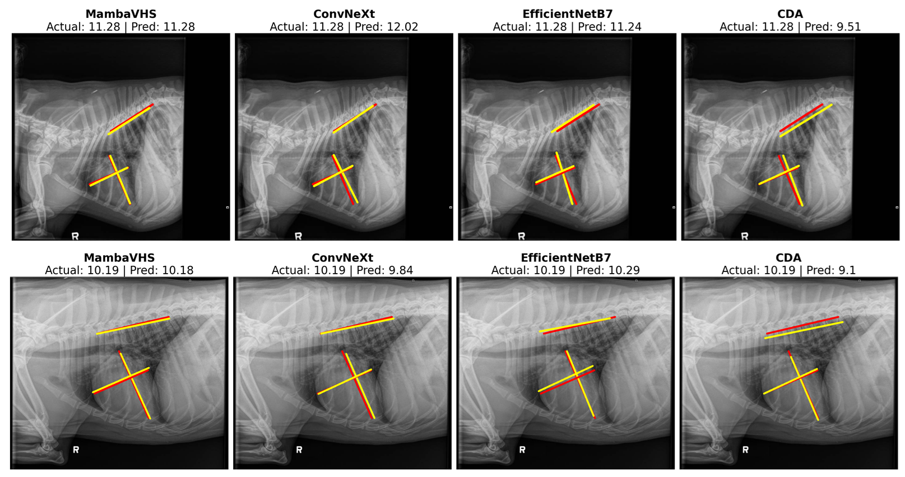

# VHSMarker: A High-Precision Annotation Tool for Canine Cardiac Keypoint Detection and VHS Estimation

🔗 GitHub Page: [https://gen-ai-research.github.io/dog-vhs/](https://gen-ai-research.github.io/dog-vhs/)


VHSMarker is a web-based tool designed for efficient and accurate annotation of canine thoracic radiographs. It supports real-time vertebral heart score (VHS) calculation, precise labeling of six anatomical keypoints, and high-performance model inference through the MambaVHS architecture.

---

## 🚀 Key Contributions

### 🐾 CCK Dataset
- 21,465 annotated lateral-view X-rays.
- Standardized keypoint labels for AB, CD, and EF measurement.
- Export formats: JSON, CSV, and `.mat`.

### ✍️ VHSMarker Annotation Tool
- Real-time VHS calculation as keypoints are placed.
- Web-based with HTML5 Canvas for pixel-precise annotations.
- Instant ONNX-based model inference for predictions.

### 🧠 MambaVHS Model
- Combines convolutional layers with Mamba blocks for long-range spatial modeling.
- SE layers for channel-wise recalibration.
- Real-time prediction in under 42ms per image.

---

## 📁 Dataset Overview

| Split      | No. of Images | Percentage |
|------------|----------------|------------|
| Training   | 15,026         | 70%        |
| Validation | 2,155          | 10%        |
| Testing    | 4,275          | 20%        |
| **Total**  | **21,465**     | **100%**   |


Download the dataset from [Hugging Face](https://huggingface.co/datasets/gen-ai-researcher/vhs_dogheart_db).

---

## 🧠 Model Architecture

The MambaVHS model combines convolutional feature extractors with Mamba blocks and residual connections.


- Stem: Two 3×3 Conv layers with SiLU and BatchNorm
- Stages: Four blocks with Residual + Mamba + SE layers
- Regression Head: GlobalAvgPooling + Linear layers

---

## 🧪 Results

| Model             | Validation Acc | Test Acc |
|------------------|----------------|----------|
| GoogleNet        | 77.5%          | 74.8%    |
| ResNet50         | 80.0%          | 84.2%    |
| EfficientNetB7   | 88.21%         | 88.41%   |
| ConvNeXt         | 88.16%         | 89.4%    |
| MambaVHS         | **89.5%**      | **91.8%**|

---

## 📸 Prediction Examples

| VHS Category          | Sample Output |
|-----------------------|----------------|
| VHS < 8.2             |  |
| 8.2 ≤ VHS ≤ 10        |  |
| VHS > 10              |  |

Predictions are color-coded with ground truth (red) and model outputs (yellow).

---

## 📊 Ablation Study

| Model Variant                 | Val Acc | Test Acc | Notes                                  |
|------------------------------|---------|----------|----------------------------------------|
| Without SE Layers            | 88.0%   | 88.5%    | Channel recalibration matters          |
| With L1 Loss Only            | 88.4%   | 88.7%    | VHSAwareLoss improves accuracy         |
| With Attention + MLP         | 80.1%   | 84.7%    | Mamba improves efficiency & accuracy   |
| Without Residual Blocks      | 82.0%   | 84.5%    | Skip connections help retain features  |
| Full MambaVHS                | 89.5%   | 91.8%    | Best performing configuration          |

---

## 🧰 Technical Stack

- Frontend: HTML5, JS, Bootstrap 5
- Backend: Flask + OpenCV + Python
- Model Runtime: ONNX + PyTorch
- Export: JSON / CSV / `.mat`

---

## ▶️ Demo

Watch the [VHSMarker tool demonstration](docs/assets/VHS.mp4) showing:
- Keypoint placement (A–F)
- Real-time VHS calculation
- ONNX model predictions

---

## 📦 Installation

Download the model checkpoint from [Google Drive](https://drive.google.com/drive/u/7/folders/1Ry-pTgbOfpOEN8ZCbqnAKW5SP5kcOjji).
The file is located at :
```bash
checkpoints\\bm_15.pth
```

```bash
git clone https://github.com/gen-ai-research/dog-vhs
cd dog-vhs
pip install -r requirements.txt
flask run

---

## 🏋️ Training and Evaluation

To train the MambaVHS model on the CCK dataset, use the following command:
```bash
cd mamba_vhs
python train.py 
python evaluate.py

```

### Conclusion
The VHSMarker framework advances canine cardiac analysis through its efficient annotation tool (10-12s/image), comprehensive CCK dataset (21,465 images), and high-accuracy MambaVHS model (91.8% test accuracy, 42ms inference), establishing a new benchmark for automated veterinary diagnostics.